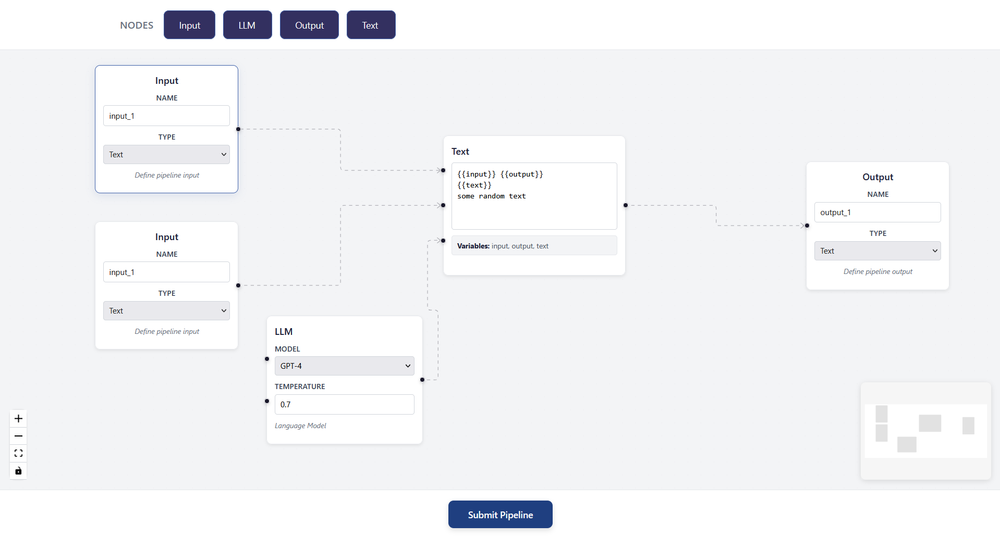
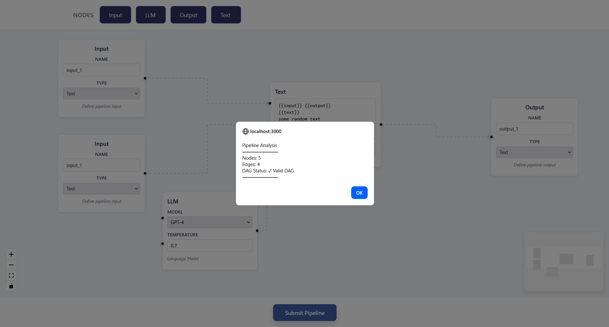

# VectorShift Frontend Technical Assessment
A modern, enterprise-grade pipeline builder with drag-and-drop node composition, dynamic variable binding, and backend DAG validation.

## 📸 Demo

### Pipeline Builder with Connected Nodes

*The frontend showing Input, LLM, Output, and Text nodes connected in a pipeline.*

### Backend Validation Alert

*Alert displaying the pipeline analysis: node count, edge count, and DAG validation status.*

---

## Priority-based organisation

**Part 4 - Backend Integration ⭐⭐⭐**

**Overview**
Full-stack integration between frontend and FastAPI backend for pipeline validation.
### What Was Built
- **Frontend (`src/submit.js`)**: 
  - POST request to `/pipelines/parse` endpoint
  - Sends `nodes` and `edges` data from the pipeline
  - Displays user-friendly alert with validation results
  
- **Backend (`/backend/main.py`)**:
  - DAG validation using **Kahn's Algorithm** (topological sort)
  - Cycle detection to ensure no infinite loops
  - Returns: `{num_nodes, num_edges, is_dag}`
### Key Technical Decisions
- **Kahn's Algorithm**: Chosen over DFS for clarity and simplicity in screen recording
- **Error Handling**: Graceful fallbacks with informative error messages
- **CORS Support**: Configured for localhost:3000 ↔ localhost:8000 communication
 
### How to Test
1. Build a pipeline with nodes and edges
2. Click "Submit Pipeline"
3. See alert with: node count, edge count, DAG status
---

**Part 1 - Node Abstraction ⭐⭐⭐**
 ### Overview
Factory pattern abstraction to dramatically reduce node creation boilerplate and improve maintainability.

### Architecture
 
#### Before (Old Approach)
```JavaScript
// Each node: ~40-52 lines of duplicated code
export const InputNode = ({ id, data }) => {
  const [currName, setCurrName] = useState(...);
  // ... handle state, render, handles ...
}
```
 
#### After (New Abstraction)
```JavaScript
// Each node: ~15 lines of config
export const InputNode = createNodeComponent({
  title: 'Input',
  fields: [{ name: 'inputName', type: 'input' }],
  getHandles: HANDLES_SINGLE_OUTPUT,
  initialState: { inputName: 'input_1' }
});
```
 
### Key Components
 
#### 1. **BaseNode Factory** (`src/nodes/baseNode.js`)
- `createNodeComponent(config)` — Returns a complete node component
- Config-driven approach: define title, fields, handles, state
- Handles state management, field rendering, and positioning
- Supports custom content via `customContent` callback
#### 2. **Handle Configuration** (`src/handleconfig.js`)
- Centralised handle patterns: `HANDLES_SINGLE_OUTPUT`, `HANDLES_LLM`, etc.
- `createHandle()` — Consistent handle definition
- `renderHandles()` — Renders handles with positioning logic
- Predefined patterns for common node types
#### 3. **Refactored Nodes** (`src/nodes/refactoredNodes.js`)
- **InputNode**: Single output, name + type fields
- **OutputNode**: Single input, name + type fields
- **LLMNode**: Two inputs (system, prompt) + one output, model selection
- **TextNode**: Special case, custom implementation for Part 3 logic
### Abstraction Benefits
✅ **DRY**: Eliminated 100+ lines of duplicated code  
✅ **Extensible**: Add new nodes in 10 lines of config  
✅ **Maintainable**: Single source of truth for node patterns  
✅ **Scalable**: Easy to apply changes across all nodes
 
### Demonstration: Five Example Nodes
Created five additional node types to showcase flexibility:
- **DatabaseNode**: Query input, results output
- **JSONParserNode**: Raw JSON input, parsed output
- **ValidatorNode**: Schema input, data input, validation output
- **RouterNode**: Condition input, multiple conditional outputs
- **AggregatorNode**: Multiple data inputs, aggregated output
---
**Part 3 - Text Node Logic ⭐⭐** 

### Overview
Dynamic text node with auto-sizing and variable binding via `{{variableName}}` syntax.
 
### Features Implemented
 
#### 1. Auto-Sizing Textarea
- Textarea expands as user types more text (max 300px)
- Minimum height 60px for empty state
- Smooth transitions for better UX
#### 2. Variable Extraction & Dynamic Handles
- Regex pattern: `\{\{([a-zA-Z_$][a-zA-Z0-9_$-]*)\}\}`
- Detects valid JavaScript variable names in double curly braces
- **Creates dynamic input handles on the LEFT** for each variable
#### 3. Variables Display
- Shows detected variables in a styled box below the textarea
- Updates in real-time as the user types
---

**Part 2 - Styling ⭐⭐**
### Overview
Enterprise-grade visual design matching VectorShift's aesthetic (navy, slate, green palette).
 
### Design System Implemented
- **Color Palette**:
  - Primary: Navy `#1e2139` (buttons, headers, primary interactive)
  - Secondary: Slate grays `#f3f4f6` to `#374151` (neutrals, backgrounds)
  - Accent: `#1f3f80` (submit button, success states)
  
- **Typography**:
  - Sans-serif for UI (system fonts)
  - Monospace for code/variables
  - Clear visual hierarchy via font weight and size
- **Spacing**: Consistent 4px–32px scale
- **Shadows**: Subtle, progressive (sm → xl)
- **Interactions**: Smooth transitions, hover/focus states
---
## 🚀 How to Run
 
### Frontend
```bash
cd frontend
npm install
npm start
# Runs on http://localhost:3000
```
 
### Backend
```bash
cd backend
pip install fastapi uvicorn
uvicorn main:app --reload
# Runs on http://localhost:8000
```


